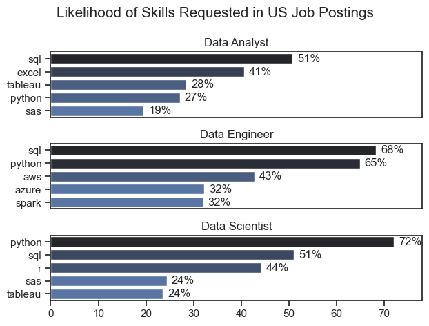
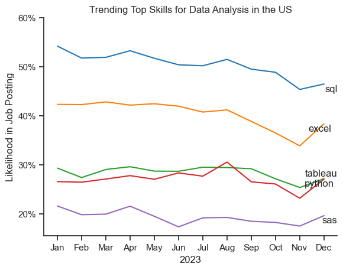
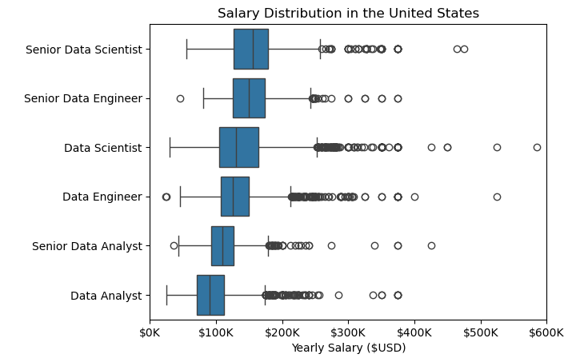
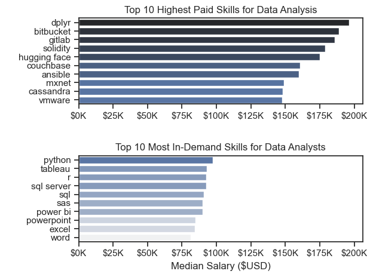
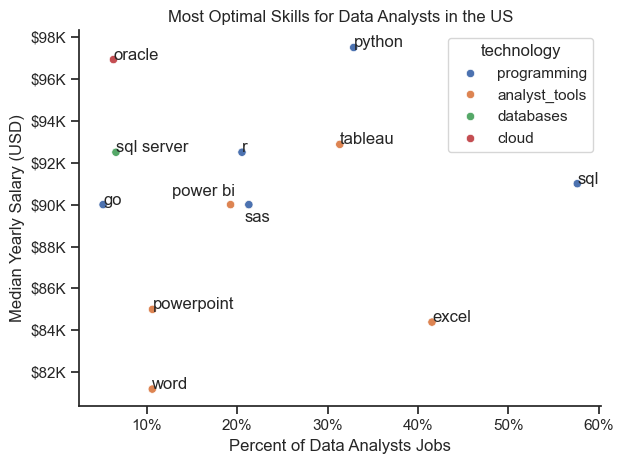

# The Analysis

## 1. What are the most demanded skills for the top 3 most popular data roles?

To answer this question, I filtered out the data roles by which ones were the most popular, and I got the top 5 skills for each of those roles. This query highlights the most popular job titles and their top skills, showing which skills I should pay attention to depending on the role I am interested in.

View my notebook with detailed steps here:

[2_Skills_Count.ipynb](3_Project/2_Skills_Count.ipynb)

### Visualize Data

```python
fig, ax = plt.subplots(len(job_titles), 1)

sns.set_theme(style='ticks')
for i, job_title in enumerate(job_titles):
    df_plot = df_skills_perc[df_skills_perc['job_title_short'] == job_title].head(5)
    # df_plot.plot(kind='barh', x='job_skills', y='skill_percent', ax=ax[i], title=job_title)
    sns.barplot(data=df_plot, x='skill_percent', y='job_skills', ax=ax[i], hue='skill_count', palette='dark:b_r')
    ax[i].set_title(job_title)
    ax[i].set_xlabel('')
    ax[i].set_ylabel('')
    ax[i].get_legend().remove()
    ax[i].set_xlim(0, 78)

    for n, v in enumerate(df_plot['skill_percent']):
        ax[i].text(v + 1, n, f'{v:.0f}%', va='center')

    if i != len(job_titles) - 1:
        ax[i].set_xticks([])

fig.suptitle('Likelihood of Skills Requested in US Job Postings', fontsize=15)
plt.tight_layout()

```

### Results



### Insights

- Python is a versatile skill, highly demanded across all three roles, but most prominently for Data Scientist (72%) and Data Engineers (65%).
- SQL is the most requested skill for Data Analysts and Data Scientists, with it in over half the job postings for both roles.
- Data Engineers require more specialized technical skills(AWS, Azure, Spark) compared to Data Analysts and Data Scientists who are expected to be proficient in more general data management and analysis tools.

## 2. How are in-demand skills trending for Data Analysts?

### Visualize Data

```python
from adjustText import adjust_text
from matplotlib.ticker import PercentFormatter

df_plot = df_DA_US_percent.iloc[ :, :5]
sns.lineplot(data=df_plot, dashes=False, palette='tab10')
sns.set_theme(style='ticks')
sns.despine()

plt.title('Trending Top Skills for Data Analysis in the US')
plt.ylabel('Likelihood in Job Posting')
plt.xlabel('2023')
plt.legend().remove()

texts = []
for i in range(5):
    text = plt.text(11.2, df_plot.iloc[-1, i], df_plot.columns[i], verticalalignment='center', horizontalalignment='left')
    texts.append(text)
adjust_text(texts)

ax = plt.gca()
ax.set_yticks(range(20, 70, 10))

ax.yaxis.set_major_formatter(PercentFormatter(decimals=0))

```

### Results


*Bar graph visualizing the trending top skills for data analysts in the US in 2023.*

### Insights

- SQL remains the most consistently demanded skill throughout the year, despite a gradual decrease in demand.
- Excel experienced a significant increase in demand in the last month of the year, after a steady decrease in demand in the previous three months.
- Both Tableau and Python maintained stable demand throughout the year with some fluctuations. 
- Sas, although less demanded compared to other skills, shows a slight increase in demand toward the end of the year.

## 3. How well do jobs and skills pay for Data Analysts?
### Salary Analysis for Data Nerds
#### Visualize Data

```python
sns.boxplot(data=df_US_top6, x='salary_year_avg', y='job_title_short', order=job_order)
plt.title('Salary Distribution in the United States')
plt.xlabel('Yearly Salary ($USD)')
plt.ylabel(" ")
ax = plt.gca()
ax.xaxis.set_major_formatter(plt.FuncFormatter(lambda x, pos: f'${int(x/1000)}K'))
plt.xlim(0, 600000)
plt.show()

```

#### Results


*Box plot visualizing the salary distributions for the top 6 data job titles.*

#### Insights

- This box plot shows a significant variation in salary across different data-related roles. Senior positions receive much higher compensation than their non-senior counterparts. Senior Data Scientists top the salary distribution with a median salary around $165k, followed closely by Senior Data Engineers.

- Data Scientists display the widest distributions, with some outliers reaching $400K-$600K, suggesting this role has the greatest earning potential. Data Analysts roles demonstrate more consistency in salary with fewer outliers.


### Highest Paid & Most Demanded Skills for Data Analysts

#### Visualize Data

```python
fig, ax = plt.subplots(2, 1)
sns.set_theme(style='ticks')
sns.barplot(data=df_DA_top_pay, x='median', y=df_DA_top_pay.index, ax=ax[0], hue='median', palette='dark:b_r')
ax[0].set_title('Top 10 Highest Paid Skills for Data Analysis')
ax[0].set_ylabel(" ")
ax[0].set_xlabel(' ')
ax[0].legend().remove()
ax[0].xaxis.set_major_formatter(plt.FuncFormatter(lambda x, _: f'${int(x/1000)}K'))

sns.barplot(data=df_DA_skills, x='median', y=df_DA_skills.index, ax=ax[1], hue='median', palette='light:b')
ax[1].set_xlim(ax[0].get_xlim())
ax[1].set_title('Top 10 Most In-Demand Skills for Data Analysts')
ax[1].set_ylabel(" ")
ax[1].set_xlabel('Median Salary ($USD)')
ax[1].legend().remove()
ax[1].xaxis.set_major_formatter(plt.FuncFormatter(lambda x, _: f'${int(x/1000)}K'))

fig.tight_layout()

```

#### Results
Here is the breakdown of the highest paid and most in-demand skills for data analysts in the US:


*Two separate bar graphs visualizing the highest paid skills and most in-demand skills for Data Analysts in the US.*

#### Insights

- The top graph shows that the highest-paid skills are predominantly specialized technical tools, such as 'dplyr', 'bitbucket', and 'gitlab'. Most of these technical skills have median salaries above $150K.

- The bottom graph shows the most in-demand skills are foundational data analysis tools like 'SQL', 'Python', and 'Tableau'. While these skills do not offer the highest salaries, they are core skills that are essential for getting hired as a Data Analyst.

- Data Analysts have the options to choose between mastering the fundamentals to maximize job opportunities, or specializing in niche technologies to potentially command premium salaries. To maximize their career potential, data analysts should consider combining high demanded foundational skills with high-paying specialized technical expertise. 

## 4. What is the most optimal skill to learn for Data Analysts?

### Visualize Data

```python
sns.scatterplot(data=df_plot, x='skill_percent', y='median_salary', hue='technology')
sns.despine()
sns.set_theme(style='ticks')

plt.xlabel('Percent of Data Analysts Jobs')
plt.ylabel('Median Yearly Salary (USD)')
plt.title('Most Optimal Skills for Data Analysts in the US')
plt.tight_layout()

ax = plt.gca()
ax.yaxis.set_major_formatter(plt.FuncFormatter(lambda y, pos: f'${int(y/1000)}K'))
ax.xaxis.set_major_formatter(PercentFormatter(decimals=0))

texts = []
for i, txt in enumerate(df_DA_skills_high_demand.index):
    x = df_DA_skills_high_demand['skill_percent'].iloc[i]
    y = df_DA_skills_high_demand['median_salary'].iloc[i]
    if txt == 'power bi':
        plt.text(x + 0.5, y + 250, txt, ha='right', va='bottom')
    elif txt == 'sas':  
        plt.text(x - 0.5, y - 250, txt, ha='left', va='top')
    else:
        texts.append(plt.text(x, y, txt))
        
plt.show()

```

### Results


*A scatter plot visualizing the most optimal skills (high paying & high demand) for data analysts in the US.*

### Insights
- The scatter plot shows that most of the programming skills (colored blue) cluster at higher salary levels compared to other categories, indicating that programming skills might offer higher salary in the data analytics field.

- Analyst tools (colored orange) like Tableau and Excel are prevalent in job postings (over 30%), indicating that visualizing and data analyst software are crucial in data analysts roles. Tableau in particular has good salaries, with its median salary at over $92K yearly.

